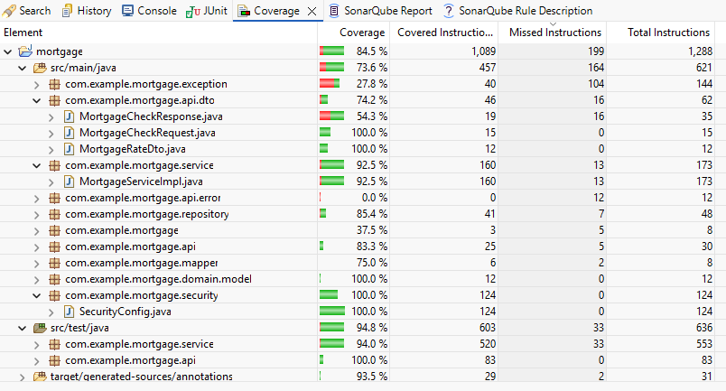
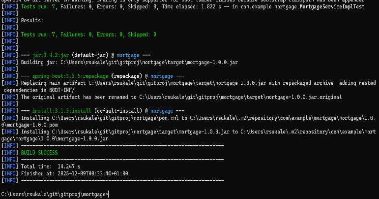

# Mortgage API

Mortgage API gets you the monthly installment applicable for your loan value.

### Requirement

User can use this API for two purposes, 
##### 1. To check the ongoing interest rates
##### 2. To find how much will be your monthly mortgage payment if you are eligible, The eligibility depends on your yearly salary, value of your house, the amount you would like to borrow and maturity years

## TL;DR - Build and Run
 
	 mvn clean install
	 
## Code Quality Factors that are taken care:

- Total 84.6% code coverage by Junit
- Using SonarLint all "Major" issues are resolved.
- No external library from untrusted source dependency is used.
- Code smell is very low.

## SWAGGER URL:
	http://localhost:8081/swagger-ui/index.html

## Screenshots:

## Next Steps / Improvement areas
##### - Caching
##### - Security could be better
##### - Containerization 